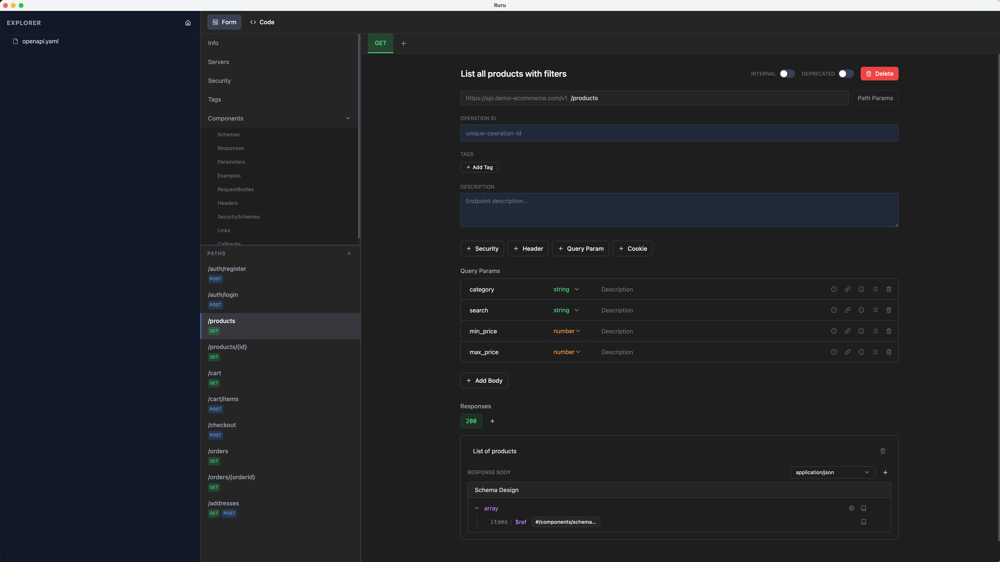

# Ruru - OpenAPI Visual Editor



A visual editor for OpenAPI specifications, built with Electron, React, and TypeScript.

> 🚧 **Work In Progress**: This project is currently under active development. Features are subject to change.

## Download

[Download the latest release](https://github.com/luania/ruru/releases)

## Features

- Visual editing of OpenAPI documents (Work in Progress)
- Electron-based desktop application
- React + Tailwind CSS UI

## Development

### Prerequisites

- Node.js
- npm

### Setup

```bash
npm install
```

### Run in Development Mode

```bash
npm run dev
```

### Build for Production

```bash
npm run build
```
